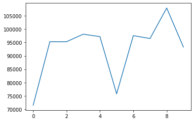
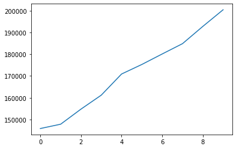
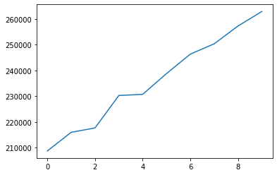
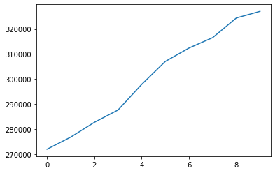

# Низкоуровневое программирование. ЛР №1

## 0. Сборка

```shell
$ cmake --build cmake-build-debug --target low_level_programming_task1 -j 6
```

## 1. Цель

Создать модуль, реализующий хранение в одном файле данных в виде графа узлов с атрибутами общим объёмом от 10GB.

## 2. Задачи

- Спроектировать структуры данных для представления информации в оперативной памяти
- Спроектировать представление данных с учетом схемы для файла данных и реализовать базовые операции для работы с ним:
  - Операции над схемой данных (создание и удаление элементов)
  - Базовые операции над элементами данными (вставка, перечисление, обновление, удаление)
- Реализовать публичный интерфейс для приведенных выше операций
- Реализовать тестовую программу для демонстрации работоспособности решения

## 3. Описание работы

Программа представляет собой следующие модули:

- **database**/ (главный модуль по работе с БД)
  - **data_manipulation**/ (CRUD-операции над данными)
  - **data_structure**/ (вспомогательные структуры данных):
    - **Куча свободных блоков**
    - **Вектор / Динамический массив**
    - **Генератор**
  - **model**/ (модели для работы с данными)
  - **serialize**/ (сериализация моделей в байты и обратно)
  - **connection** (контекст подключения к БД)
  - **buffer_manager** (содержит заголовок БД и кучу свободных блоков)
  - **database_manager** (базовые операции над БД)
  - **exceptions** (модель ошибки)
  - **query_manager** (обработчик запросов)
  - **visualize** (вывод моделей)

Подключение к БД делается с помощью методов `database_open` и `database_close`:

```c
char *db_name = "database.qdb";
RC rc = RC_OK;
Connection connection = {0};

rc = database_open(db_name, &connection);
throw_if_not_ok(rc);

rc = database_close(&connection);
throw_if_not_ok(rc);
```

Запрос создается с помощью структуры `Query`:

```c
typedef struct {
    QueryType type;
    union {
        SchemaCreateQuery schema_create_query;
        SchemaGetQuery schema_get_query;
        SchemaDeleteQuery schema_delete_query;

        NodeCreateQuery node_create_query;
        NodeUpdateQuery node_update_query;
        NodeDeleteQuery node_delete_query;
        NodeMatchQuery node_match_query;

        LinkCreateQuery link_create_query;
        LinkUpdateQuery link_update_query;
        LinkDeleteQuery link_delete_query;

        MatchQuery match_query;
    };
} Query;
```

Пример запроса:

```c
NodeCondition MATCH_CONDITION = {
        .schema = schema,
        .conditions_num = 2,
        .compare_conditions = (ConditionCompare[2]) {
                {
                        .left = {.type = CMPT_FIELD_NAME, .field_name = "id"},
                        .cmp = CMP_GREATER,
                        .right = {.type = CMPT_VALUE, .value = &(Value) {
                            .data_type = DT_INTEGER, .integer = 1189641421
                        }}
                },
                {
                        .left = {.type = CMPT_FIELD_NAME, .field_name = "name"},
                        .cmp = CMP_LESS,
                        .right = {.type = CMPT_VALUE, .value = &(Value) {
                            .data_type = DT_STRING, .string = &(String) {7, "naaaaaa"}
                        }}
                }
        }};

Query GET_NODES_WITH_CONDITION = (Query) {
        .type = NODE_MATCH,
        .node_match_query = (NodeMatchQuery) {
                    .condition = MATCH_CONDITION
        }
};
qr = query_execute(GET_NODES_WITH_CONDITION, &connection);
node_vector = node_vector_fetch_all(qr.generator);
V_ITERATE(node_vector, i) node_print(node_vector_get(i, node_vector));
```

Пример вывода:

```
(1804289383, gwlyvpv, true)
(1681692777, gmgmama, true)
(1714636915, cdinhaw, true)
(1350490027, hlceyoh, true)
(2044897763, gfjhlkx, true)
(1365180540, fpyywbb, false)
(1540383426, edqaxol, false)
(1303455736, ljgjgdg, false)
```

Для обновления и удаления можно использовать тот же вектор:

```c
Query UPDATE_NODES = (Query) {
        .type = NODE_UPDATE,
        .node_update_query = (NodeUpdateQuery) {
                .schema = schema,
                .attributes_to_update_number = 1,
                .attributes_to_update = (char *[1]) {"name"},
                .new_values = (Value *[1]) {&(Value) {.data_type = DT_STRING, .string = &(String) {7, "abobusp"}}},
                .node_vector = node_vector
        }
};

qr = query_execute(UPDATE_NODES, &connection);
```

Результатом запроса может быть:

```c
typedef enum {
    RESULT_SCHEMA,      // Схему
    RESULT_GENERATOR,   // Генератор
    RESULT_NONE         // Ничего
} QueryResultType;
```

### Модели

Модель представляется в двух видах: так, как она хранится в базе (префикс DB_) и так, как она используется в клиентской части.

#### Схема

```c
typedef struct __attribute__((packed)) {
    pointer name_string_pointer;            // Указатель на имя схемы
    amount attr_count;                      // Количество атрибутов
    pointer *attr_pointers;                 // Указатели на атрибуты
    pointer schema_next_pointer;            // Указатель на след. схему
} DB_Schema;

typedef struct {
    String *name;
    amount attr_count;
    Attribute **attributes;

    pointer _db_ptr;
} Schema;
```

#### Атрибут

```c
typedef struct __attribute__((packed)) {
    pointer name_string_pointer;
    DataType data_type;
} DB_Attribute;

typedef struct {
    String *name;
    DataType data_type;
} Attribute;
```

#### Value, значение поля

```c
typedef struct {
    DataType data_type;
    union {
        dt_integer integer;
        dt_string string;
        dt_floating floating;
        dt_boolean boolean;
    };
} Value;
```

##### Возможные типы данных

```c
typedef enum {
    DT_INTEGER = 0,
    DT_STRING = 1,
    DT_FLOATING = 2,
    DT_BOOLEAN = 3
} DataType;

typedef int32_t dt_integer;
typedef String *dt_string;
typedef float dt_floating;
typedef bool dt_boolean;
```

#### Строка

```c
typedef struct {
    amount size;
    char *content;
} String;
```

#### Узел (вершина)

```c
typedef struct __attribute__((packed)) {
    pointer schema_pointer;
    amount value_count;
    pointer *value_pointers;
    pointer node_prev_pointer;
    pointer node_next_pointer;
} DB_Node;

typedef struct {
    amount value_count;
    Value **values;

    pointer _db_ptr;
    pointer _node_prev_ptr;
    pointer _node_next_ptr;

    pointer _schema_ptr;
} Node;
```

#### Связь (ребро)

```c
typedef struct __attribute__((packed)) {
    pointer link_name_string_pointer;
    LinkType link_type;

    pointer node_first_pointer;
    pointer node_second_pointer;

    pointer link_prev_pointer;
    pointer link_next_pointer;
} DB_Link;

typedef struct {
    String *name;
    LinkType type;

    pointer _db_ptr;
    pointer _link_prev_ptr;
    pointer _link_next_ptr;
} Link;

typedef enum {
    LT_DIRECTED_TO,
    LT_DIRECTED_FROM,
    LT_DIRECTED_BOTH,

    LT_ANY,
} LinkType;
```

#### Результат выборки

```c
typedef struct {
    Return return_items;
    Node *first;
    Link *link;
    Node *second;
} Result;
```

### Сериализация

Перевод модели в байты и DB_модель.

```c
RC db_node_to_bytes(DB_Node *db_node, byte *bytes) {
    amount i = 0;
    field_to_bytes(db_node, schema_pointer, bytes, i);
    field_to_bytes(db_node, value_count, bytes, i);
    field_array_to_bytes(db_node, value_pointers, db_node->value_count, bytes, i);
    field_to_bytes(db_node, node_prev_pointer, bytes, i);
    field_to_bytes(db_node, node_next_pointer, bytes, i);
    return RC_OK;
}

RC db_node_from_bytes(DB_Node *db_node, byte *bytes) {
    amount i = 0;
    field_from_bytes(db_node, schema_pointer, bytes, i);
    field_from_bytes(db_node, value_count, bytes, i);
    field_array_from_bytes(db_node, value_pointers, db_node->value_count, bytes, i);
    field_from_bytes(db_node, node_prev_pointer, bytes, i);
    field_from_bytes(db_node, node_next_pointer, bytes, i);
    return RC_OK;
}
```

## 4. Аспекты реализации

### Хранение данных

#### Блоки

Все модели оборачиваются в блок:

```c
typedef struct __attribute__((packed)) {
    uint8_t is_free;                        // свободен / занят
    amount size;                            // размер данных в блоке
    amount capacity;                        // ёмкость блока (обычна равна размеру)
    byte *content;                          // сериализованные данные
} Block;
```

Блоки не имеют фиксированного размера, благодаря чему можно хранить данные любой длины и заполнять отступы (если блоки были бы фиксированной длины) полезными данными.

#### Schema

- Заголовок БД указывает на первую и последнюю схемы.
- Схема ссылается на следующую схему.

#### Node

- Заголовок БД указывает на первый и последний узлы. 
- Узел ссылается на предыдущий и следующий узлы. 

#### Link

- Заголовок БД указывает на первую и последнюю связи. 
- Связь содержит ссылки на узлы.
- Связь ссылается на предыдущий и следующий узлы.

### Структуры данных

#### Куча свободных блоков

Используется для быстрого получения самого большого свободного блока, в который можно вставить данные. Это позволяет достичь вставки за O(1).
Если подходящего блока нет, то вставляем в конец файла.

```
                                                                                                                                       [( ); &3316; 0044]                                                                                                                                       
                                                               [( ); &3422; 0044]                                                                                                                              [( ); &4553; 0044]                                                               
                           [( ); &0886; 0011]                                                      [( ); &4164; 0044]                                                      [( ); &4677; 0012]                                                      [( ); &4740; 0012]                           
         [( ); &2954; 0009]                  [( ); &3220; 0009]                  [( ); &2465; 0008]                  [( ); &4535; 0009]                  [( ); &0869; 0008]                  [( ); &4698; 0012]                  [( ); &2864; 0008]                  [( ); &2922; 0005]         
[( ); &2066; 0008][( ); &3130; 0008][( ); &3188; 0005][( ); &2124; 0005][( ); &0661; 0005][( ); &0927; 0005][( ); &2523; 0005][( ); &0603; 0008][( ); &2731; 0008][( ); &1002; 0008][( ); &2789; 0005][( ); &4719; 0012][( ); &1060; 0005]
```

#### Генератор

Используется для эффективной по памяти операции выборки. Структура содержит результат, контекст и ссылку на функцию next.

```c
typedef struct Generator {
    void *result;
    void *context;

    void *(*next_function)(struct Generator *);
} Generator;

void *generator_next(Generator *generator);
```

#### Вектор / Динамический массив

Используется для удобной работы с данными без фиксированной длины. Благодаря макросам можно легко типизировать:

```c
// Объявление
DECLARE_VECTOR(Node, node)

// Реализация
DEFINE_VECTOR(BlockNode, block_node)
```

```c
#define DECLARE_VECTOR(Type, type)                                                                                      \
struct Type##Vector;                                                                                                    \
typedef struct Type##Vector Type##Vector;                                                                               \
Type##Vector *type##_vector_init();                                                                                     \
void type##_vector_free(Type##Vector *type##_vector);                                                                   \
void type##_vector_push(Type *type, Type##Vector *type##_vector);                                                       \
Type *type##_vector_get(size_t index, Type##Vector *type##_vector);                                                     \
Type##Vector *type##_vector_fetch_all(Generator *generator);                                                            \
size_t type##_vector_get_size(Type##Vector *type##_vector);                                                             \
size_t type##_vector_get_capacity(Type##Vector *type##_vector);                                                         \
void type##_vector_set(size_t index, Type *type, Type##Vector *type##_vector);                                          \
Type *type##_vector_pop(Type##Vector *type##_vector);                                                                   \
```

### Алгоритмы

#### Добавление модели

С помощью кучи свободных блоков (получение вершины кучи) находим место для вставки за O(1).

#### Удаление модели

Находим блок с моделью за O(N) и все блоки, которые принадлежат этой модели (атрибуты, строки, значения). Освобождаем их за O(1) и добавляем в кучу свободных блоков. Кучу можно перестроить за O(N), поэтому под требуемые асимптотики удаления подходит.

Изменение ссылок в связном списке происходит за O(1).

#### Изменение модели

Находим модель за O(N). Если изменяемое значение - строка, то удаляем и аллоцируем заново. Здесь также можно перестроить кучу.

#### Получение модели

1. Получение схемы - проход по связному списку схем внутри файла (O(N)).
2. Получение вершин - проход по связному списку вершин внутри файла (O(N)).
3. Получение связи (+вершин) - проход по связному списку ребер внутри файла (O(N)).
4. Получение пары вершин без связи - проход по связному списку вершин для каждой схемы (O(NM)).

## 5. Результаты

### Вставка

10 замеров, добавление по 1000 вершин



### Получение

10 замеров, добавление по 1000 вершин и получение по случайному условию



### Обновление

10 замеров, добавление по 1000 вершин и обновление вершин



### Удаление

10 замеров, добавление по 1000 вершин и удаление вершин



## 6. Выводы

В ходе работы была реализована графовая база данных на языке C, поддерживающая все CRUD операции над схемами, вершинами и ребрами. В процессе я тесно повзаимодействовал с языком C, организацией структуры БД в одном файле, реализацией структур данных и алгоритмов с их использованием. Были соблюдены все условия и асимптотики.

Было очень сложно, но интересно. Будет что рассказать внукам и интервьюерам.